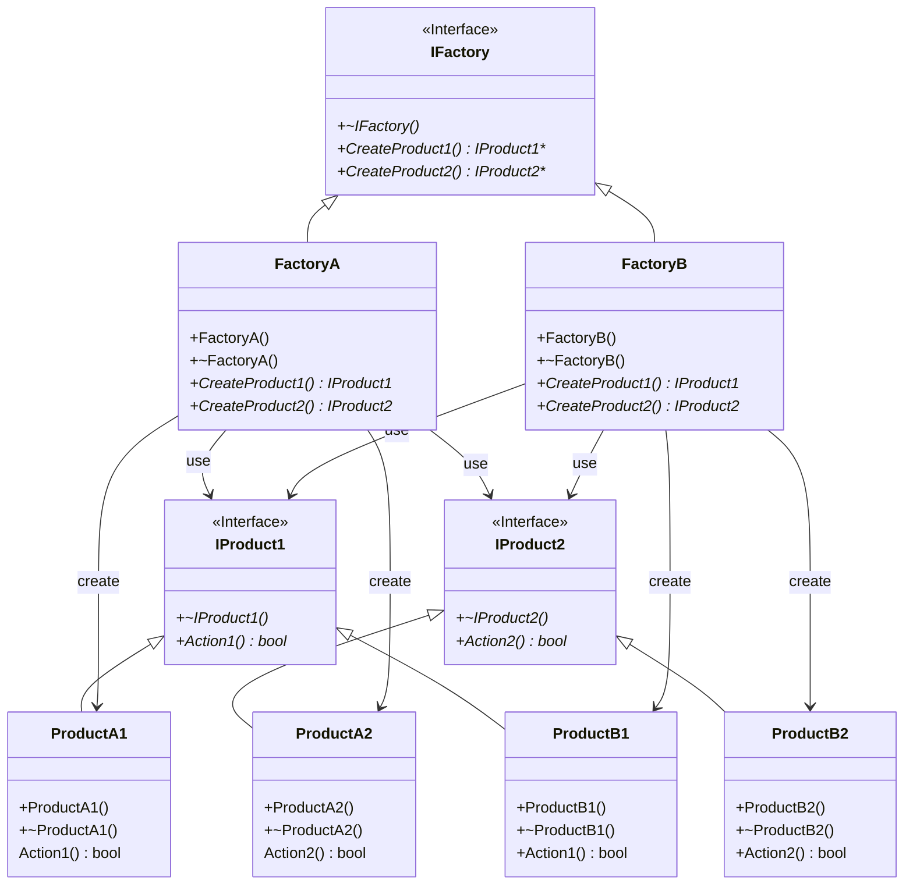
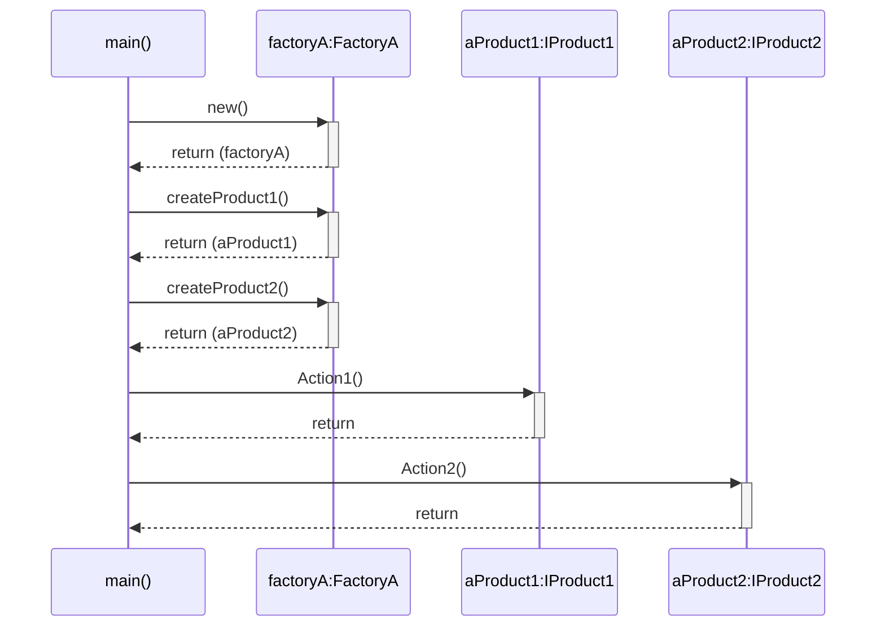

# Abstract Factory

複雑なクラス構成になっているが、要点は以下となる。

- 一連のオブジェクト群を生成するFactoryを生成する。
- 生成したFactoryでProduct群を生成する。

## Class Diagram

```mermaid
classDiagram
  direction TB
  class IProduct1 {
    <<Interface>>
    +~IProduct1()*
    +Action1()* bool
  }
  class ProductA1 {
    +ProductA1()
    +~ProductA1()
    Action1() bool
  }
  class ProductB1 {
    +ProductB1()
    +~ProductB1()
    +Action1() bool
  }
  
  class IProduct2 {
    <<Interface>>
    +~IProduct2()*
    +Action2()* bool
  }
  class ProductA2 {
    +ProductA2()
    +~ProductA2()
    Action2() bool
  }
  class ProductB2 {
    +ProductB2()
    +~ProductB2()
    +Action2() bool
  }
  
  class IFactory {
    <<Interface>>
    +~IFactory()*
    +CreateProduct1()* IProduct1*
    +CreateProduct2()* IProduct2*
  }
  class FactoryA {
    +FactoryA()
    +~FactoryA()
    +CreateProduct1() IProduct1*
    +CreateProduct2() IProduct2*
  }
  class FactoryB {
    +FactoryB()
    +~FactoryB()
    +CreateProduct1() IProduct1*
    +CreateProduct2() IProduct2*
  }
  
  IFactory <|-- FactoryA
  IFactory <|-- FactoryB
  IProduct1 <|-- ProductA1
  IProduct1 <|-- ProductB1
  IProduct2 <|-- ProductA2
  IProduct2 <|-- ProductB2
  FactoryA --> ProductA1 : create
  FactoryA --> ProductA2 : create
  FactoryA --> IProduct1 : use
  FactoryA --> IProduct2 : use
  FactoryB --> ProductB1 : create
  FactoryB --> ProductB2 : create
  FactoryB --> IProduct1 : use
  FactoryB --> IProduct2 : use
```

## Sequence Diagram

```mermaid
sequenceDiagram
  participant main as  main()
  participant factoryA as factoryA:FactoryA
  participant aProduct1 as aProduct1:IProduct1
  participant aProduct2 as aProduct2:IProduct2

  main      ->>+  factoryA : new()
  factoryA  -->>- main     : return (factoryA)
  
  main      ->>+  factoryA : createProduct1()
  factoryA  -->>- main     : return (aProduct1)
  
  main      ->>+  factoryA : createProduct2()
  factoryA  -->>- main     : return (aProduct2)

  main      ->>+  aProduct1 : Action1()
  aProduct1 -->>- main      : return

  main      ->>+  aProduct2 : Action2()
  aProduct2 -->>- main      : return
```