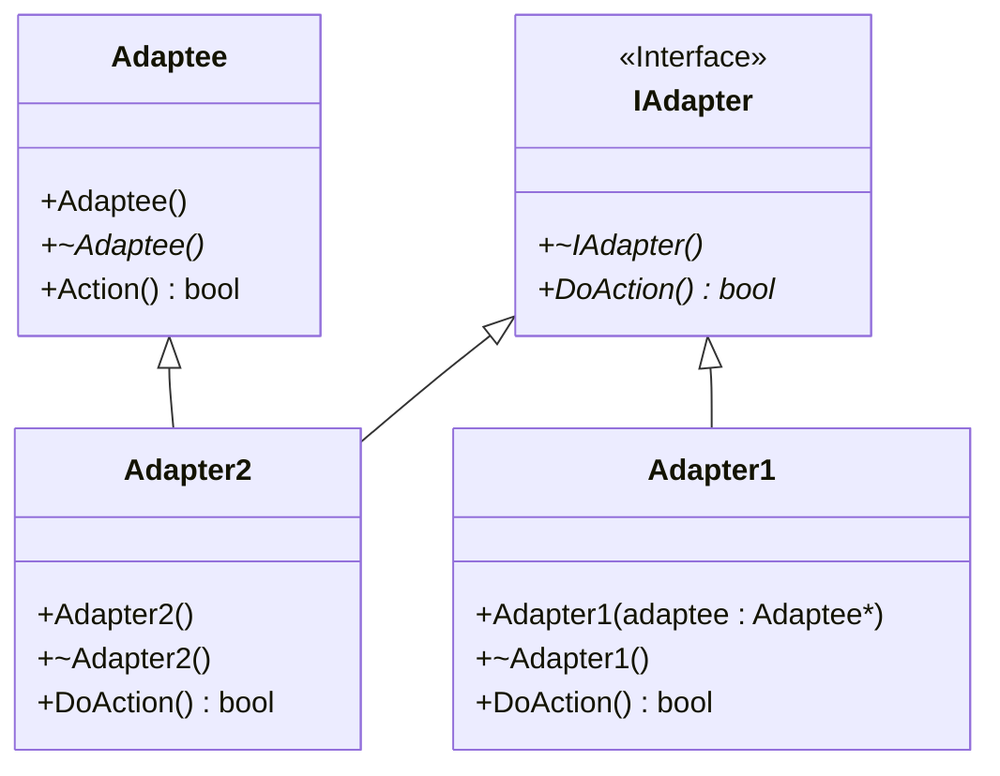
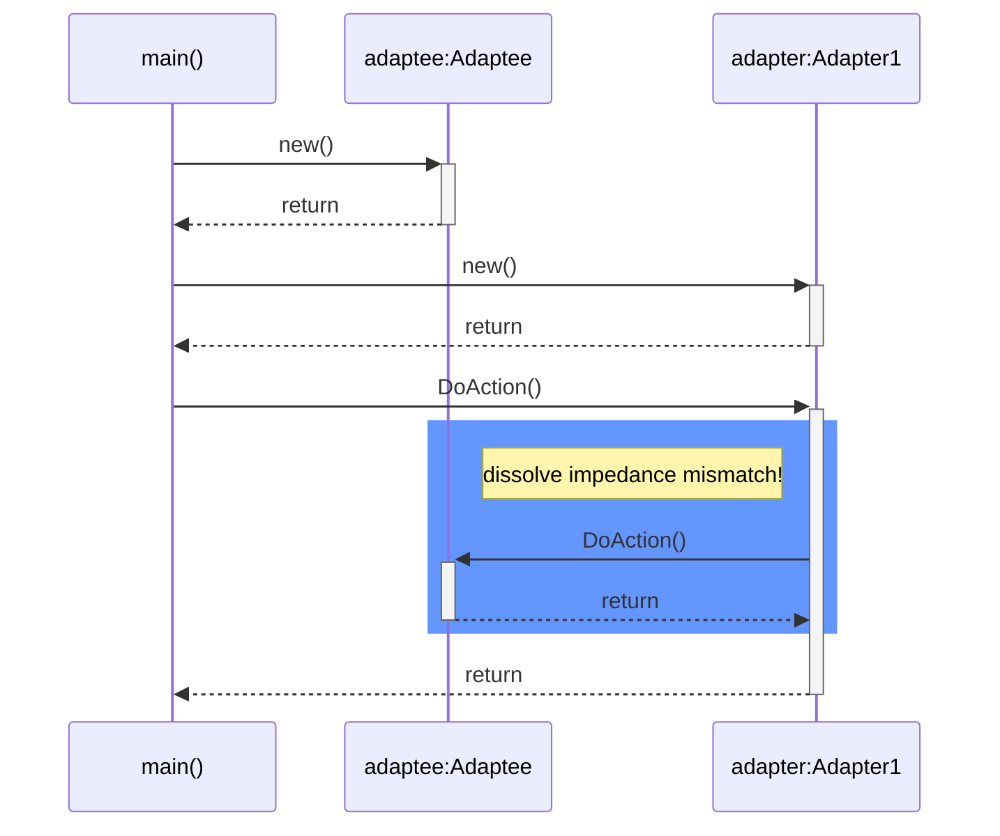

# Adapter

## Class Diagram

```mermaid
classDiagram
  direction TB
  class Adaptee {
    +Adaptee ()
    +~Adaptee ()*
    +Action() bool
  }
  class IAdapter {
    <<Interface>>
    +~IAdapter()*
    +DoAction()* bool
  }
  class Adapter1 {
    +Adapter1(adaptee : Adaptee*)
    +~Adapter1()
    +DoAction() bool
  }
  class Adapter2 {
    +Adapter2()
    +~Adapter2()
    +DoAction() bool
  }
  
  Adaptee <|-- Adapter2
  IAdapter <|-- Adapter1
  IAdapter <|-- Adapter2
```

## Sequence Diagram

```mermaid
sequenceDiagram
  participant main as  main()
  participant adaptee as adaptee:Adaptee
  participant adapter as adapter:Adapter1

  main ->>+ adaptee : new()
  adaptee -->>- main : return
  main ->>+ adapter : new()
  adapter -->>- main : return
  main ->>+ adapter : DoAction()
  rect rgb(100, 150, 255)
  note left of adapter : dissolve impedance mismatch!
  adapter ->>+ adaptee : DoAction()
  adaptee -->>- adapter : return
  end
  adapter -->>- main : return
```