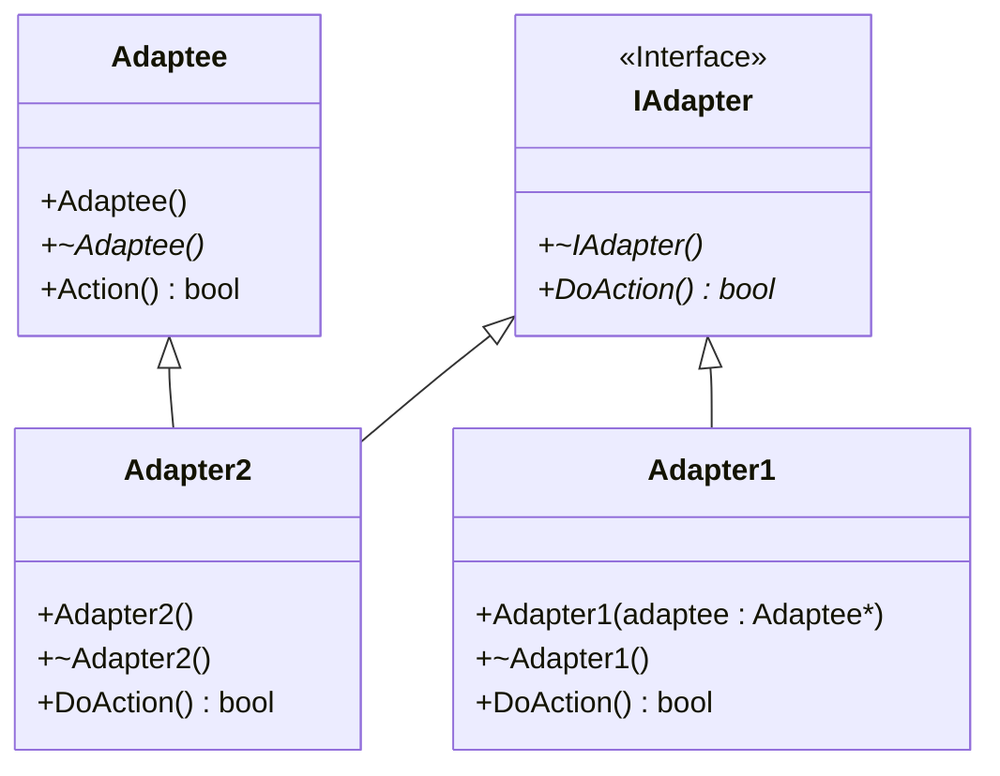

# Adapter

```mermaid
classDiagram
  direction TB
  class Adaptee {
    +Adaptee ()
    +~Adaptee ()*
    +Action() bool
  }
  class IAdapter {
    <<Interface>>
    +~IAdapter()*
    +DoAction()* bool
  }
  class Adapter1 {
    +Adapter1(adaptee : Adaptee*)
    +~Adapter1()
    +DoAction() bool
  }
  class Adapter2 {
    +Adapter2()
    +~Adapter2()
    +DoAction() bool
  }
  
  Adaptee <|-- Adapter2
  IAdapter <|-- Adapter1
  IAdapter <|-- Adapter2
```