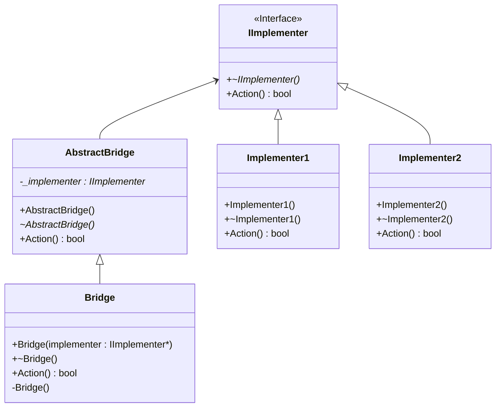

# Bridge

```mermaid
classDiagram
direction TB
  class IImplementer {
    <<Interface>>
    +~IImplementer()*
    +Action() bool
  }
  class AbstractBridge {
    -_implementer : IImplementer*
    +AbstractBridge()
    ~AbstractBridge()*
    +Action() bool
  }
  class Implementer1 {
    +Implementer1()
    +~Implementer1()
    +Action() bool
  }
  class Implementer2 {
    +Implementer2()
    +~Implementer2()
    +Action() bool
  }
  class Bridge {
    +Bridge(implementer : IImplementer*)
    +~Bridge()
    +Action() bool
    -Bridge()
  }

  IImplementer <|-- Implementer1
  IImplementer <|-- Implementer2
  IImplementer <-- AbstractBridge
  AbstractBridge <|-- Bridge
```