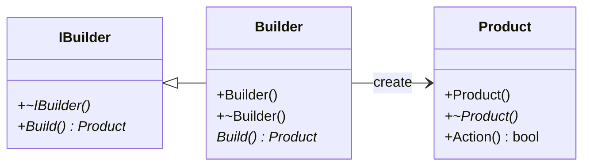

# Builder

```mermaid
classDiagram
direction LR
  class Product {
    +Product()
    +~Product()*
    +Action() bool
  }
  class IBuilder {
    +~IBuilder()*
    +Build() Product*
  }
  class Builder {
    +Builder()
    +~Builder()
    Build() Product*
  }

  IBuilder <|-- Builder
  Builder --> Product : create
```