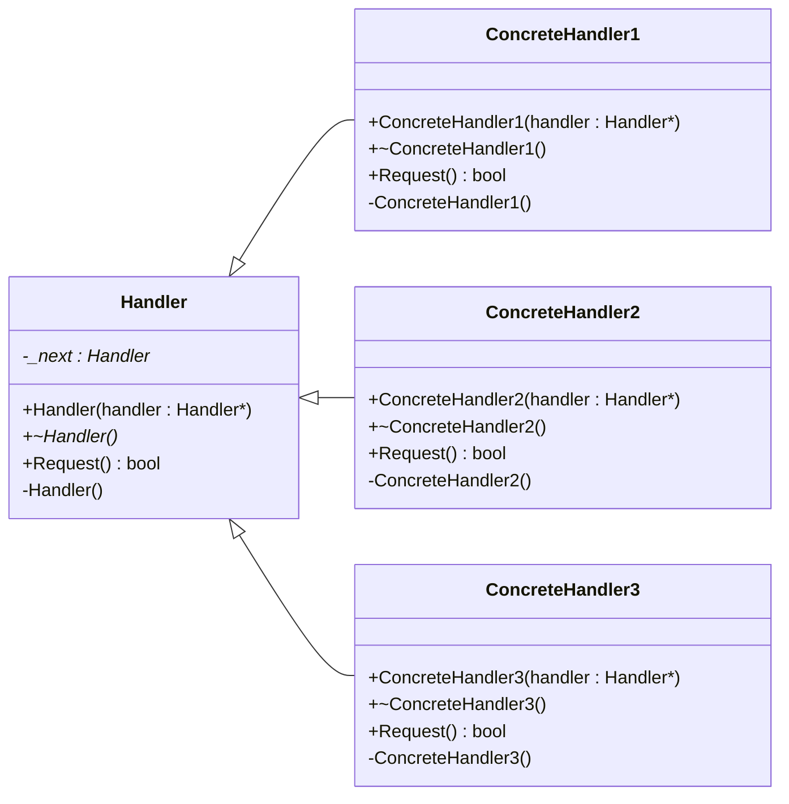

# ChainOfResponsibility

```mermaid
classDiagram
direction LR
  class Handler {
    -_next : Handler*
    +Handler(handler : Handler*)
    +~Handler()*
    +Request() bool
    -Handler()
  }
  class ConcreteHandler1 {
    +ConcreteHandler1(handler : Handler*)
    +~ConcreteHandler1()
    +Request() bool
    -ConcreteHandler1()
  }
  class ConcreteHandler2 {
    +ConcreteHandler2(handler : Handler*)
    +~ConcreteHandler2()
    +Request() bool
    -ConcreteHandler2()
  }
  class ConcreteHandler3 {
    +ConcreteHandler3(handler : Handler*)
    +~ConcreteHandler3()
    +Request() bool
    -ConcreteHandler3()
  }
  
  Handler <|-- ConcreteHandler1
  Handler <|-- ConcreteHandler2
  Handler <|-- ConcreteHandler3
```