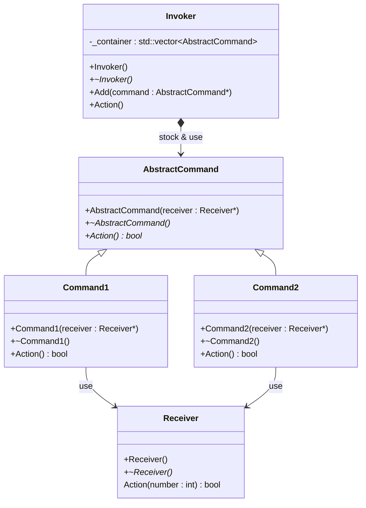

# Command

```mermaid
classDiagram
direction TB
  class Receiver {
    +Receiver()
    +~Receiver()*
    Action(number : int) bool
  }
  class AbstractCommand {
    +AbstractCommand(receiver : Receiver*)
    +~AbstractCommand()*
    +Action()* bool
  }
  class Command1 {
    +Command1(receiver : Receiver*)
    +~Command1()
    +Action() bool
  }
  class Command2 {
    +Command2(receiver : Receiver*)
    +~Command2()
    +Action() bool
  }
  class Invoker {
    -_container : std::vector~AbstractCommand~
    +Invoker()
    +~Invoker()*
    +Add(command : AbstractCommand*)
    +Action()
  }
  
  AbstractCommand <|-- Command1
  AbstractCommand <|-- Command2
  Command1 --> Receiver : use
  Command2 --> Receiver : use
  Invoker *--> AbstractCommand : stock & use
```