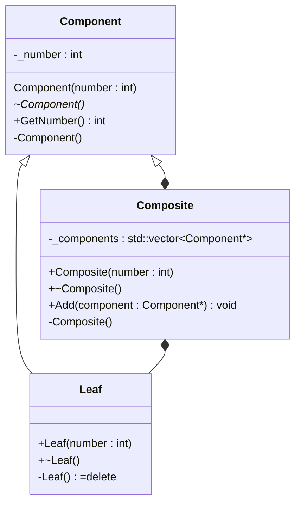

# Composite

```mermaid
classDiagram
direction TB
  class Component {
    -_number : int
    Component(number : int)
    ~Component()*
    +GetNumber() int
    -Component()
  }
  class Composite {
    -_components : std::vector~Component*~
    +Composite(number : int)
    +~Composite()
    +Add(component : Component*) void
    -Composite()
  }
  class Leaf {
    +Leaf(number : int)
    +~Leaf()
    -Leaf()=delete
  }

  Component <|--* Composite
  Component <|-- Leaf
  Composite *-- Leaf
```