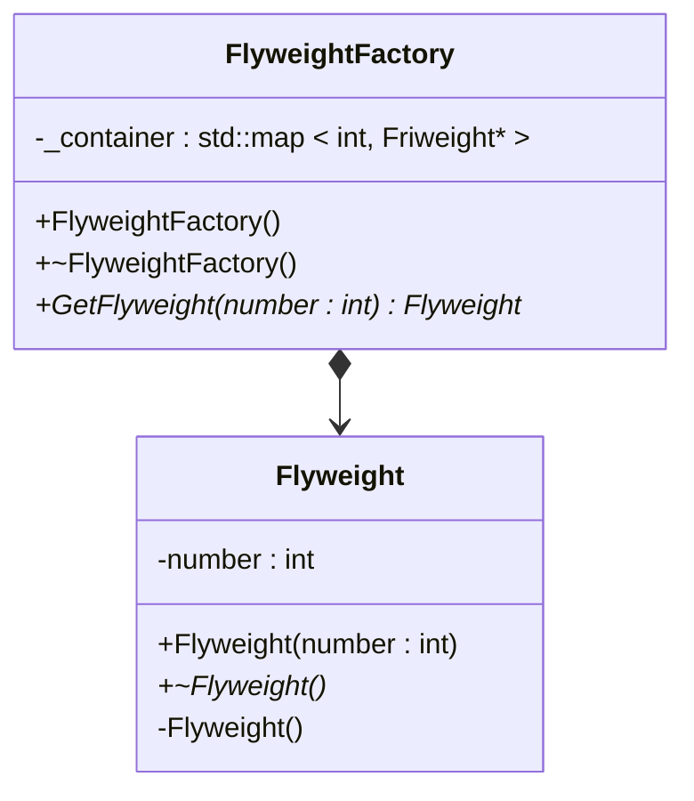

# Flyweight

```mermaid
classDiagram
direction TB
  class Flyweight {
    -number : int
    +Flyweight(number : int)
    +~Flyweight()*
    -Flyweight()
  }
  class FlyweightFactory {
    %%mermaidのバグ回避策
    -_container : std::map < int, Friweight* >
    +FlyweightFactory()
    +~FlyweightFactory()
    +GetFlyweight(number : int) Flyweight*
  }

  FlyweightFactory *--> Flyweight
```